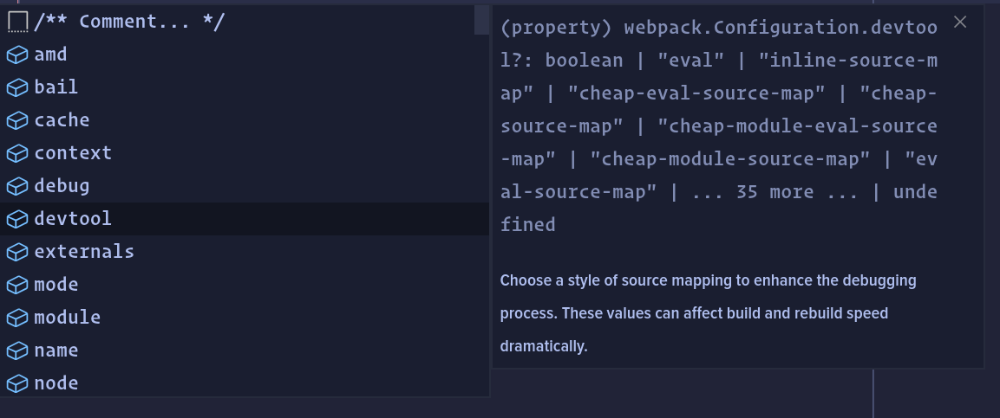

# Webpack TS


A neat little tool that helps you make webpack configs with typescript typings.

## Usage

```bash
yarn add -D webpack-ts
```

## Example

```typescript
// webpack.config.ts
import { makeConfig } from 'webpack-ts';
import { join } from 'path'

const config = makeConfig({
  entry: "dist/index.js",
  output: {
    path: join(__dirname, "dist"),
    filename: "[name].js"
  }
})

module.exports = config
```

## Editor integration


